# Mobile App Pages and Per-Page Phases

**Source:** [Mobile App Schema and Structure plan](file:///Users/fathallah/.cursor/plans/mobile_app_schema_and_structure_f3aa868d.plan.md), [mobile/lib/screens](mobile/lib/screens), [mobile/lib/app.dart](mobile/lib/app.dart).

---

## 1. Complete Page List

All user-facing screens in the mobile app:

| # | Page | Route(s) | Role | File(s) |

| --- | -------------------------------- | ------------------------ | ------ | ----------------------------------- |

| 1 | Login | `/` (via AuthGate) | Shared | `login_page.dart`, `auth_gate.dart` |

| 2 | Forgot password | `/forgot-password` | Shared | `forgot_password_page.dart` |

| 3 | Settings | `/settings` | Shared | `settings_page.dart` |

| 4 | Admin reject | `/admin-reject` | Shared | `admin_reject_page.dart` |

| 5 | Doctor Dashboard | tab in `/doctor` | Doctor | `doctor/dashboard_page.dart` |

| 6 | Doctor Patients list | tab in `/doctor` | Doctor | `doctor/patients_list_page.dart` |

| 7 | Doctor Patient detail | `/doctor/patient-detail` | Doctor | `doctor/patient_detail_page.dart` |

| 8 | Doctor Add patient | `/doctor/patients/add` | Doctor | `doctor/add_patient_page.dart` |

| 9 | Doctor Edit patient | `/doctor/patient-edit` | Doctor | `doctor/edit_patient_page.dart` |

| 10 | Doctor Record reading | tab in `/doctor` | Doctor | `doctor/record_reading_page.dart` |

| 11 | Doctor Reports | tab in `/doctor` | Doctor | `doctor/reports_page.dart` |

| 12 | Doctor Advanced search | `/doctor/search` | Doctor | `doctor/search_page.dart` |

| 13 | Doctor Notifications | tab in `/doctor` | Doctor | `doctor/notifications_page.dart` |

| 14 | Nurse Quick dashboard | tab in `/nurse` | Nurse | `nurse/dashboard_page.dart` |

| 15 | Nurse Assigned patients | tab in `/nurse` | Nurse | `nurse/assigned_patients_page.dart` |

| 16 | Nurse Patient detail (read-only) | `/nurse/patient-detail` | Nurse | `nurse/patient_detail_page.dart` |

| 17 | Nurse Quick record | tab in `/nurse` | Nurse | `nurse/quick_record_page.dart` |

| 18 | Nurse Notifications | tab in `/nurse` | Nurse | `nurse/notifications_page.dart` |

**Shells (navigation only):** `doctor_shell.dart`, `nurse_shell.dart`. Not treated as separate page phases.

---

## 2. Phase 0 – Foundation (prerequisite for data pages)

**Goal:** Data layer so each page phase can fetch/write Firestore without duplicating logic.

**Scope:**

- **Models:** Mirror [frontend types](frontend/src/types/firestore.ts) (e.g. `User`, `Patient`, `Reading`, `ReadingTemplate`, `Report`, `Notification`). Use `Timestamp` / `DocumentReference` where applicable.
- **Firestore helpers:** Paths and operations aligned with [firestore-helpers](frontend/src/lib/firestore-helpers.ts): `patients`, `patients/{id}/readings`, `readingTemplates`, `users`, `users/{id}/notifications`, `reports`, etc. Role-based filters: doctor → `doctorId == uid`, nurse → `nurseId == uid`.
- **Placement:** e.g. `lib/models/`, `lib/data/` (or `lib/firestore/`). No UI.

**Deliverable:** Models + Firestore service/repository that other phases can import. Auth (Firebase Auth + `users/{uid}` role) is already implemented; Foundation only adds Firestore data access.

---

## 3. Phases 1–4 – Shared pages

| Phase | Page | Goal | Notes |

| ----- | --------------- | ---------------------------- | ----------------------------------------------------------------------------------------------------------------------------------------------------------- |

| **1** | Login | Polish only | Auth already works (Firebase, role fetch). Optional: validation, loading UX, accessibility. |

| **2** | Forgot password | Polish only | Reset flow works. Optional: validation, success/error UX. |

| **3** | Settings | Full implementation | Profile (name, phone, maybe avatar), preferences (language, theme, units, notification toggles from `User.preferences`), logout. Read/update `users/{uid}`. |

| **4** | Admin reject | Keep as-is or minimal tweaks | Message + logout. No data layer. |

---

## 4. Phases 5–13 – Doctor pages

| Phase | Page | Goal | Data / actions |

| ------ | ---------------------- | --------------------- | ------------------------------------------------------------------------------------------------------------------------------------------------------------------------------------------------------ |

| **5** | Doctor Dashboard | Real UI + data | Summary stats (patient counts, recent readings, alerts). Use `queryPatients` (doctor filter), readings (e.g. from `patients/{id}/readings` or collection-group if used), optional `getPatientAlerts`. |

| **6** | Doctor Patients list | List + filters + nav | `queryPatients` by `doctorId`; filters (status, search); tap → `/doctor/patient-detail` with `id`. |

| **7** | Doctor Patient detail | Full detail view | `getPatient`; list `readings`, `medicalNotes`, `medications`, `alerts`; links to edit, record reading. |

| **8** | Doctor Add patient | Form + create | Form aligned with [PatientForm](frontend/src/components/dashboard/forms/PatientForm.tsx) / [createPatientSchema](frontend/src/utils/validators.ts). `createPatient`; set `doctorId = currentUser.uid`. |

| **9** | Doctor Edit patient | Form + update | Same form as Add, pre-filled from `getPatient`. `updatePatient`. |

| **10** | Doctor Record reading | Form + create reading | Patient picker (or from context), `getReadingTemplates`, form for values. Create in `patients/{id}/readings`; update patient denormalized fields if applicable. |

| **11** | Doctor Reports | List and/or generate | Use `queryPatients`, `queryAllReadings` (or per-patient readings) for report data. List existing reports if stored; otherwise “generate” UX only. |

| **12** | Doctor Advanced search | Search UI + queries | Search patients/readings (e.g. by name, date, value). Reuse Firestore helpers with filters; display results, link to patient detail or reading. |

| **13** | Doctor Notifications | List notifications | `users/{uid}/notifications`. List, mark read, optional delete. |

---

## 5. Phases 14–18 – Nurse pages

| Phase | Page | Goal | Data / actions |

| ------ | -------------------------------- | ------------------ | ------------------------------------------------------------------------------------------------------------------------------------------------------------ |

| **14** | Nurse Quick dashboard | Real UI + data | Stats for **assigned** patients only (`nurseId == uid`): counts, recent readings, alerts. Same patterns as Doctor Dashboard but nurse-scoped. |

| **15** | Nurse Assigned patients | List + nav | `queryPatients` by `nurseId`; tap → `/nurse/patient-detail` with `id`. |

| **16** | Nurse Patient detail (read-only) | View-only detail | Same data as Doctor Patient detail but **no** edit / add patient / reports. View patient, readings, notes, alerts. |

| **17** | Nurse Quick record | Quick record form | Record reading for **assigned** patient only. Simpler flow than Doctor “Record reading”: patient selector (assigned only), template, values, create reading. |

| **18** | Nurse Notifications | List notifications | Same as Doctor Notifications: `users/{uid}/notifications`. |

---

## 6. Dependency overview

```mermaid
flowchart TD
  P0[Phase 0 Foundation]
  P1[Phase 1 Login]
  P2[Phase 2 Forgot password]
  P3[Phase 3 Settings]
  P4[Phase 4 Admin reject]
  P5[Phase 5 Doctor Dashboard]
  P6[Phase 6 Patients list]
  P7[Phase 7 Patient detail]
  P8[Phase 8 Add patient]
  P9[Phase 9 Edit patient]
  P10[Phase 10 Record reading]
  P11[Phase 11 Reports]
  P12[Phase 12 Advanced search]
  P13[Phase 13 Doctor Notifications]
  P14[Phase 14 Nurse Dashboard]
  P15[Phase 15 Assigned patients]
  P16[Phase 16 Nurse Patient detail]
  P17[Phase 17 Quick record]
  P18[Phase 18 Nurse Notifications]

  P0 --> P3
  P0 --> P5
  P0 --> P6
  P0 --> P7
  P0 --> P8
  P0 --> P9
  P0 --> P10
  P0 --> P11
  P0 --> P12
  P0 --> P13
  P0 --> P14
  P0 --> P15
  P0 --> P16
  P0 --> P17
  P0 --> P18

  P1 -.->|already done| P0
  P2 -.->|already done| P0
  P4 -.->|no data| P0
```

- **Phase 0** is required for any phase that uses Firestore (Settings, all Doctor/Nurse data pages).
- **Phases 1, 2, 4** need no Foundation work; 1 and 2 are polish, 4 is static.
- **Phases 6 ↔ 7, 15 ↔ 16:** List pages navigate to detail; can be implemented in either order once Foundation exists.
- **Phases 8, 9** use the same form shape; can share a widget.
- **Phases 13, 18** use the same notifications API; can share a widget.

---

## 7. Working on a single phase

For **Phase N** (one page):

1. **Prerequisites:** Phase 0 done if the page uses Firestore; auth already in place for login/forgot-password.
2. **Scope:** Limit changes to that page’s screen(s), any page-specific widgets, and shared widgets/models only if you introduce them for this page.
3. **Routing:** Already defined in [app.dart](mobile/lib/app.dart) and shells; ensure the page receives route args (e.g. `patientId`) where needed (detail, edit, record).
4. **Testing:** Run app → sign in as doctor or nurse → navigate to the page → verify data and actions.

This keeps each phase isolated to “one page” so you can work on it alone.
